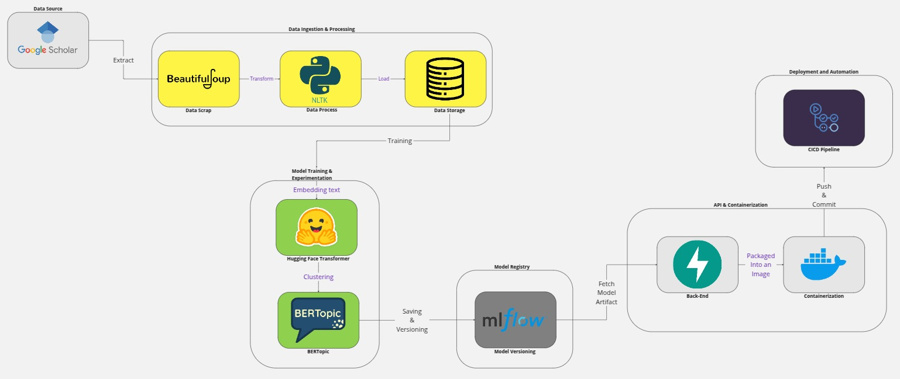

# Journalyze
Journalyze is a machine learning model for topic modeling in journal searches from Google Scholar in 2024 using BERTopic. 

## 🤟🏻 Group Name : Pedal Revo
Here are the people behind **Journalyze**

| No. | Name                 | NIM |
|-----|----------------------|-----|
| 1.  | Jonathan Young       |225150201111039     |
| 2.  | Federico Roberto D.S |225150200111043     |
| 3.  | Nada Firdaus                     |225150207111089     |

## ℹ️   Data Source
We take journal data more precisely in 2024 using sources from https://scholar.google.com

## 🧱    Directory Structure
**Journalyze** follows a structured directory organization to maintain clarity and modularity. Below is an overview of the project directory structure:
<pre>
.
├── README.md
├── data
│   ├── scholar_results.txt
│   └── test_scrap.py
├── docker-compose.yaml
├── models
├── notebooks
│   └── eda.ipynb
├── requirements.txt
├── results
└── src
    ├── backend
    ├── frontend
    └── ml
</pre>

## 🛠️   Tools
Tools we use to develop **Journalyze**

| No. | Tools                              | Function                                           |
|-----|------------------------------------|----------------------------------------------------|
| 1.  | **Beautifulsoup**                  | Used for scrapping journals on google scholar.     |
| 2.  | **NLTK(Natural Language Toolkit)** | Used for preprocessing the scrapped data.          |
| 3.  | **Hugging Face Transformer**       | Used for generating text embedding.                |
| 4.  | **BERTopic**                       | Used for clustering topics based on embeddings.    |
| 5.  | **MLFlow**                         | Used for model tracking, versioning, and registry. |
| 6.  | **FastAPI**                        | Used to build and serve the backend API.           |
| 7.  | **Docker**                         | Used for containerizing the application.           |
| 8.  | **Github Action**                  | Used for automating CI/CD pipelines                |

## 🏃🏿‍♂️‍➡️ How to Run Our Program 
Follow these steps to set up and run **Journalyze** on your local machine.
1. Clone the repository
```sh
   git clone https://github.com/jonatyoung/Journalyze.git && cd Journalyze
   ```
2. It's recommended to use a virtual environment to manage dependencies
```sh
   python -m venv venv
   source venv/bin/activate  # On macOS/Linux
   venv\Scripts\activate  # On Windows
   ```
3. Run the following command to install all required dependencies
```sh
   pip install -r requirements.txt
   ```
4. At the moment, only the scraping functionality is available. Run the following command to perform scraping
```sh
   python test_scrap.py
   ```

## 📐    Architecture
This MLOps architecture begins with **Google Scholar** as the data source. The data is extracted using **BeautifulSoup** for web scraping, then processed with **NLTK** for text transformation. Once processed, the data is stored in a database for further use.  

For **model training and experimentation**, the stored data is used to generate **text embeddings** with **Hugging Face Transformers**. These embeddings are then clustered using **BERTopic** to identify meaningful topics.  

Once the model is trained, it is registered and versioned in **MLflow**, ensuring proper tracking of model artifacts. The stored models are then fetched by the **FastAPI backend**, which serves as an API to interact with the trained model.  

To enable **deployment and automation**, the backend is containerized using **Docker**. The **CI/CD pipeline** is responsible for pushing and committing changes to ensure smooth deployment and updates of the system.

