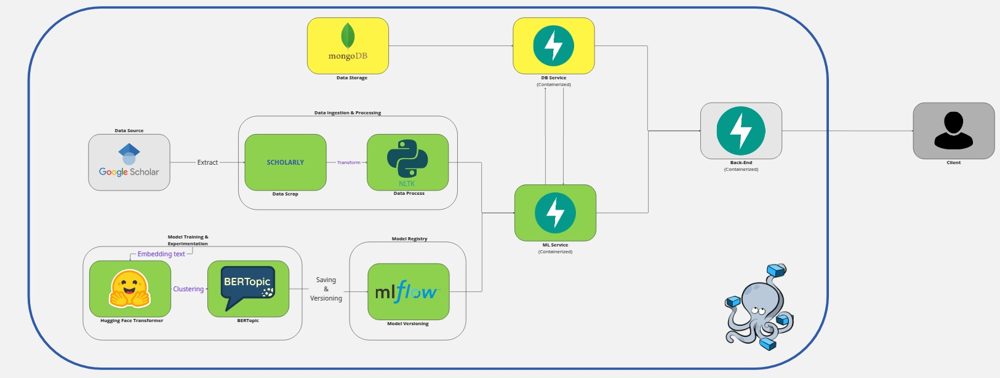

# Journalyze
Journalyze is a machine learning model for topic modeling in journal searches from Google Scholar in 2024 using BERTopic. 

## 🤟🏻 Group Name : Pedal Revo
Here are the people behind **Journalyze**

| No. | Name                 | NIM |
|-----|----------------------|-----|
| 1.  | Jonathan Young       |225150201111039     |
| 2.  | Federico Roberto D.S |225150200111043     |
| 3.  | Nada Firdaus                     |225150207111089     |

## ℹ️   Data Source
We take journal data more precisely in 2024 using sources from https://scholar.google.com

## 🧱    Directory Structure
**Journalyze** follows a structured directory organization to maintain clarity and modularity. Below is an overview of the project directory structure:
<pre>
.
├── MLOps-Architecture.jpg
├── Makefile
├── README.md
├── data
│   ├── preprocessed
│   │   ├── bert_embeddings.npy
│   │   └── preprocessed_data.csv
│   ├── raw
│   │   └── hasil_topik.csv
│   └── scholar_results.json
├── docker-compose.yaml
├── init-mongo.sh
├── models
│   └── bertopic_model.pkl
├── notebooks
│   └── eda.ipynb
├── requirements.txt
└── src
    ├── backend
    │   ├── Dockerfile
    │   ├── app
    │   │   ├── main.py
    │   │   └── scrap_result_model.py
    │   └── requirements.txt
    ├── db
    │   ├── Dockerfile
    │   ├── app.py
    │   ├── mongo.py
    │   ├── requirements.txt
    │   └── scrap_result_model.py
    └── ml
        ├── Dockerfile
        ├── app.py
        ├── pipeline.py
        ├── preprocessed_scholar_results.json
        ├── requirements.txt
        └── train.py
</pre>

## 🛠️   Tools
Tools we use to develop **Journalyze**

| No. | Tools                              | Function                                           |
|-----|------------------------------------|----------------------------------------------------|
| 1.  | **Scholarly**                  | Used for scrapping journals on google scholar.     |
| 2.  | **NLTK(Natural Language Toolkit)** | Used for preprocessing the scrapped data.          |
| 3.  | **Hugging Face Transformer**       | Used for generating text embedding.                |
| 4.  | **BERTopic**                       | Used for clustering topics based on embeddings.    |
| 5.  | **MLFlow**                         | Used for model tracking, versioning, and registry. |
| 6.  | **FastAPI**                        | Used to build and serve the backend API.           |
| 7.  | **Docker**                         | Used for containerizing the application.           |
| 8.  | **Github Action**                  | Used for automating CI/CD pipelines                |

## 🏃🏿‍♂️‍➡️ How to Run Our Program 
Follow these steps to set up and run **Journalyze** on your local machine.
1. Clone the repository
```sh
   git clone https://github.com/jonatyoung/Journalyze.git && cd Journalyze
   ```
2. It's recommended to use a virtual environment to manage dependencies
```sh
   python -m venv myvenv
   source myvenv/bin/activate  # On macOS/Linux
   myvenv\Scripts\activate  # On Windows
   ```
3. To run the **Journalyze** service, you can simply run the magic command below:
```sh
   make compose-up
   ```
   
4. If you want to stop the service from running, you can run the magic command below:
```sh
   make compose-down
   ```
You can see what APIs exist and want to execute them, you can see the subsections below

## 🔥   API Documentation
You can access the **Journalyze** API documentation via the link below:

[Journalyze API Docs](https://ubiquitous-telegram-vxpvx46q5pvc6w7v-8010.app.github.dev/docs#/)

## 📐    Architecture
This MLOps architecture adopts a **microservices approach** using **Docker** and is orchestrated via **Docker Compose** for efficient service management and scalability.

The system starts with **Google Scholar** as the primary data source. A dedicated **Data Scraping Service**, containerized using Docker, extracts scholarly data using **Scholarly (based on BeautifulSoup)**. The extracted data is then passed to the **Data Processing Service**, which applies **NLTK** for text cleaning and transformation.

All cleaned data is persisted into a **MongoDB database**, which is managed within its own container, handled via a **Database Service**.

For **model training and experimentation**, the architecture includes a separate **ML Service**. This service utilizes **Hugging Face Transformers** to generate text embeddings, which are then clustered using **BERTopic** to uncover relevant research topics. Trained models and artifacts are saved and versioned through **MLflow**, which is integrated into the ML service pipeline.

To expose the results and interact with external users, a standalone **Back-End Service** built with **FastAPI** serves as the gateway. It fetches trained models from the MLflow registry and responds to client requests via RESTful APIs.

Each service (data scraping, processing, ML, DB, and backend) is containerized via **Dockerfiles**, and the entire system is orchestrated with **Docker Compose**, ensuring seamless inter-service communication and simplified deployment.

